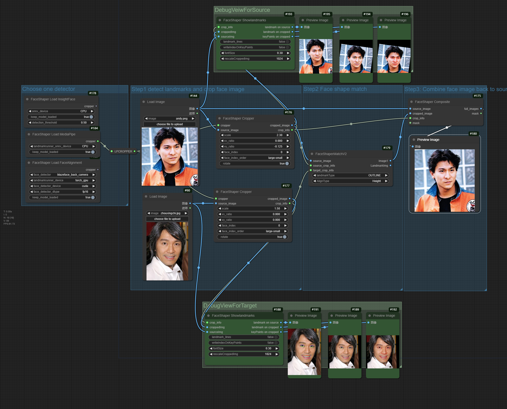
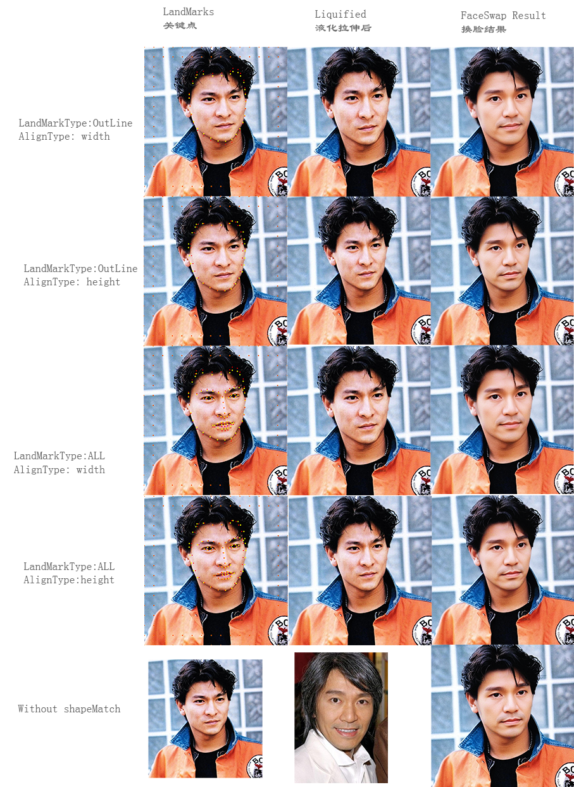

# ComfyUI_FaceShaper
Match two faces' shape before using other face swap nodes

图片换脸的工具在换脸的时候一般都只把五官特征换上，脸型则没有换。当目标人物和原照片里的人物脸型相差很多的时候，换脸结果就不太理想。
本项目是一个小脚本，能按照目标人物的脸部轮廓纵横比例先把原始照片中的人脸进行液化拉伸。得到的结果可以作为其他换脸节点的输入。

Face-swapping tools typically only replace facial features during the swap, without altering the facial shape. When there is a significant difference in facial shape between the target person and the person in the original photo, the result of the face swap is less satisfactory.This project is a small script that can first liquefy and stretch the face in the original photo according to the horizontal and vertical proportions of the target person's facial contour. The resulting image can be used as input for other face-swapping nodes.

## V2
V2版本为了解决倾斜的脸的问题，把操作分成了三步。首先切割出脸部区域并摆正面部。然后对两张切割出来的图片进行面部形状匹配。最后把处理后的图片贴回到原始图片上。
你也可以对切割出来的并进行过面部形状匹配的图片进行换脸之后，再贴回原始图片。请尽量尝试各种方案。

The V2 version, to address the issue of tilted faces, divides the operation into three steps. First, it cuts out the facial area and aligns the face. Then, it performs facial shape matching on the two cut-out images. Finally, the processed images are pasted back onto the original image.
You can also perform face swapping on the cut-out images that have undergone facial shape matching, and then paste them back onto the original image. Please feel free to try various approaches.

V2版本，可以在不安装dlib的情况下使用。You can run V2 without dlib.

## dlib替代方案 replacement for dlib
参考了[ComfyUI-LivePortraitKJ](https://github.com/kijai/ComfyUI-LivePortraitKJ)的代码，可以选择使用 face-alignment, MediaPipe或者insightFace

legacy节点保持原有逻辑，如果安装了dlib可以继续使用

It references the code from [ComfyUI-LivePortraitKJ](https://github.com/kijai/ComfyUI-LivePortraitKJ), where you can choose to use face-alignment, MediaPipe, or insightFace.
The legacy node maintains the original logic and can continue to be used if dlib is installed.

## install
run in ComfyUI/custom_nodes:  
git clone https://github.com/fssorc/ComfyUI_FaceShaper  

## 必须要的文件 File you muse download
https://huggingface.co/Kijai/LivePortrait_safetensors/tree/main

下载landmar.onnx 放到 models/liveportrait

下载landmark_model.pth，放到 models/liveportrait

这次的代码更新，参考了[ComfyUI-LivePortraitKJ](https://github.com/kijai/ComfyUI-LivePortraitKJ)的代码，保留了其中面部检测部分并稍作修改。
为了节省大家的磁盘空间，模型文件存放路径与[ComfyUI-LivePortraitKJ](https://github.com/kijai/ComfyUI-LivePortraitKJ)完全相同，如果已经安装了https://github.com/kijai/ComfyUI-LivePortraitKJ就可以直接使用本插件

This code update references the code from [ComfyUI-LivePortraitKJ](https://github.com/kijai/ComfyUI-LivePortraitKJ), retaining and slightly modifying the facial detection part.
To save everyone's disk space, the model file storage path is identical to ComfyUI-LivePortraitKJ. If you have already installed [ComfyUI-LivePortraitKJ](https://github.com/kijai/ComfyUI-LivePortraitKJ), you can directly use this plugin.

## 脸部识别三选一，或者都装了。Choose one, or all of them

您可以使用Insightface，或者使用Google的MediaPipe。或者 [face-alignment](https://github.com/1adrianb/face-alignment)

最大的区别是许可证：Insightface严格用于非商业用途。MediaPipe在检测方面稍逊一筹，并且不能在Windows上的GPU上运行，与Insightface相比，在CPU上运行速度要快得多。
face-alignment也是免费许可

### Insightface
Insightface不会自动安装，如果您希望使用它，请按照以下说明操作：如果您有一个工作正常的编译环境，安装它可以非常简单：

pip install insightface
或者对于便携版本，在ComfyUI_windows_portable文件夹中：

python_embeded/python.exe -m pip install insightface
如果这失败了（很可能），您可以查看reactor node的故障排除部分，以获取替代方案：

[reactor node](https://github.com/Gourieff/comfyui-reactor-node)的Troubleshoot部分

对于insightface模型，请将此解压到ComfyUI/models/insightface/buffalo_l：

[buffalo_l.zip](https://github.com/deepinsight/insightface/releases/download/v0.7/buffalo_l.zip)下载链接

请注意，insightface许可证的性质是非商业性的。

You can either use the Insightface, or Google's MediaPipe， or https://github.com/1adrianb/face-alignment
Choose one , you can run matcher, or you can install all of them for compare.

Biggest difference is the license: Insightface is strictly for NON-COMMERCIAL use. MediaPipe is a bit worse at detection, and can't run on GPU in Windows, though it's much faster on CPU compared to Insightface
with three options, everything should now be covered under MIT and Apache-2.0 licenses when using it.
 
Insightface is not automatically installed, if you wish to use it follow these instructions: If you have a working compile environment, installing it can be as easy as:
pip install insightface

or for the portable version, in the ComfyUI_windows_portable -folder:

python_embeded/python.exe -m pip install insightface

If this fails (and it's likely), you can check the Troubleshooting part of the reactor node for alternative:

https://github.com/Gourieff/comfyui-reactor-node
For insightface model, extract this to ComfyUI/models/insightface/buffalo_l:

https://github.com/deepinsight/insightface/releases/download/v0.7/buffalo_l.zip

Please note that insightface license is non-commercial in nature.

### face-alignment
到https://github.com/hollance/BlazeFace-PyTorch/tree/master

下载 anchors.npy blazeface.pth blazefaceback.pth 

放到系统用户目录下，例如

在windows系统是 C:\Users\[UserName]\.cache\torch\hub\checkpoints\

在Linux系统是 ~/.cache/torch/hub/checkpoints

以上三个文件不需要事先下载，在节点运行的时候会自动下载

### MediaPipe

pip install -r requirement.txt

## 用V1 legacy版本的节点会需要Dlib，以下是安装指引。Legacy nodes, Dlib Installation

For DLIB download [Shape Predictor](https://huggingface.co/matt3ounstable/dlib_predictor_recognition/resolve/main/shape_predictor_68_face_landmarks.dat?download=true),  
[Face Predictor 5 landmarks](https://huggingface.co/matt3ounstable/dlib_predictor_recognition/resolve/main/shape_predictor_5_face_landmarks.dat?download=true),  
[Face Predictor 81 landmarks](https://huggingface.co/matt3ounstable/dlib_predictor_recognition/resolve/main/shape_predictor_81_face_landmarks.dat?download=true)   
and the [Face Recognition](https://huggingface.co/matt3ounstable/dlib_predictor_recognition/resolve/main/dlib_face_recognition_resnet_model_v1.dat?download=true)   
models and place them into the `dlib` directory.  

if you get error when installing Dlib, try this:  
Precompiled Dlib for Windows can be found [here](https://github.com/z-mahmud22/Dlib_Windows_Python3.x).  

put dlib model files in ComfyUI/models/dlib/  
shape_predictor_68_face_landmarks.dat  
shape_predictor_81_face_landmarks.dat  
shape_predictor_5_face_landmarks.dat  

## Test Results:
the faceSwap tool I am using is [instantId](https://github.com/cubiq/ComfyUI_InstantID) and [DZ_FaceDetailer](https://github.com/nicofdga/DZ-FaceDetailer)  

Added whole faceswapping workflow.  

## Thank you !!  
While writing the code, I was inspired by [ComfyUI_FaceAnalysis](https://github.com/cubiq/ComfyUI_FaceAnalysis), and I would like to express my gratitude here.
V2 Code was inspired by [ComfyUI-LivePortraitKJ](https://github.com/kijai/ComfyUI-LivePortraitKJ), THANK YOU VERY MUCH!

